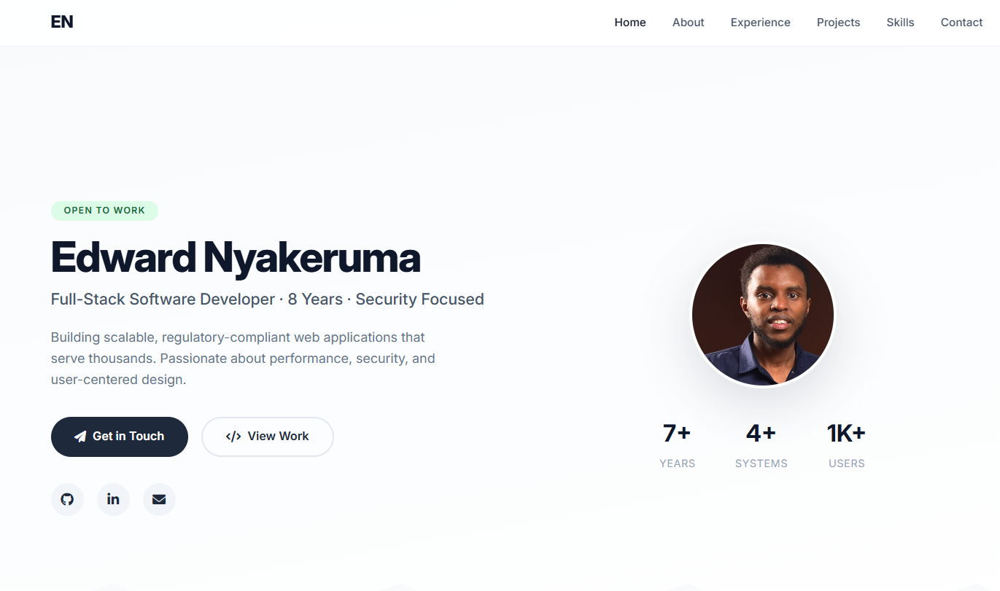

# Edward Nyakeruma — Portfolio

> Professional portfolio website for Edward Nyakeruma — Full-Stack Developer with 8 years of experience.

**Live Demo:** [https://e-nyakeruma.github.io/portfolio](https://e-nyakeruma.github.io/portfolio)

---

## About

This is a modern, responsive portfolio website designed to showcase Edward Nyakeruma's professional experience, skills, projects, and achievements. Built with a focus on clean design, fast performance, and recruiter-friendly navigation.

The site highlights:
- 8 years of full-stack development experience
- 4 mission-critical systems serving 1,000+ users
- Technical skills across JavaScript, TypeScript, PHP, React, Laravel, MySQL, Docker, and Azure
- Security expertise (MSc System Security + CEH certified)
- Project portfolio with real-world applications

---

## Features

| Feature | Description |
|---------|-------------|
| **Responsive Design** | Optimized for desktop, tablet, and mobile devices |
| **Smooth Navigation** | Fixed navbar with active section highlighting |
| **Interactive UI** | Hover effects, smooth scrolling, and animations |
| **Contact Form** | Opens email client with pre-filled message |
| **Resume Download** | One-click download of PDF resume |
| **Dark/Light Ready** | Clean, professional color scheme |
| **SEO Optimized** | Meta tags and semantic HTML |
| **Accessibility** | ARIA labels and semantic structure |

---

## Technologies Used

| Category | Technologies |
|----------|--------------|
| **Frontend** | HTML5, CSS3, JavaScript (ES6+) |
| **Fonts** | Google Fonts (Inter) |
| **Icons** | Font Awesome 6 |
| **Hosting** | GitHub Pages |
| **Version Control** | Git & GitHub |

---

## Contact

Thank you for visiting my portfolio. I'm always open to new opportunities, collaborations, and meaningful conversations.

---

### 🔗 Social & Professional

| Platform | Link |
|----------|------|
| **Primary:** | [edward.isaboke@gmail.com](mailto:edward.isaboke@gmail.com)
| **LinkedIn** | [linkedin.com/in/edward-nyakeruma](https://linkedin.com/in/edward-nyakeruma) |
| **GitHub** | [github.com/edward](https://github.com/edward) |
| **Portfolio** | [yourusername.github.io/portfolio](https://yourusername.github.io/portfolio) |

---
